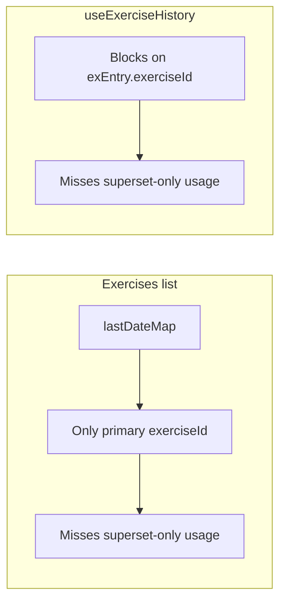

# Gym Jam UX and data fixes

## Context (how things work today)

- **Session edit** lives in [`src/routes/sessions/$sessionId.tsx`](src/routes/sessions/$sessionId.tsx). Edit mode supports `updateDraftSet` and `removeDraftSet` but there is **no** `addDraftSet` or UI to append a set—only per-set remove and per-exercise remove.
- **Reps** are stored as `Segment.r: number` in [`src/db/index.ts`](src/db/index.ts). New rows in [`src/routes/log.tsx`](src/routes/log.tsx) and [`src/components/log/SetRow.tsx`](src/components/log/SetRow.tsx) use `r: 0`, and `onChange` maps empty input to `0`, so the field shows **0** instead of blank.
- **“Last session” on the exercises list** is built in [`src/routes/exercises/index.tsx`](src/routes/exercises/index.tsx) by iterating `sess.exercises` and only using `ex.exerciseId`. Superset partners appear only as `seg.exId` inside `sets`, so they never update `lastDateMap`—this explains **calf raise only as superset** showing **—** for date.
- **Exercise detail history** uses [`src/hooks/use-exercise-history.ts`](src/hooks/use-exercise-history.ts), which **skips** entire session blocks unless `exEntry.exerciseId === exerciseId`. So an exercise that only appears as a superset partner can show **no history** and wrong stats.
- **Scroll**: The scrollable region is [`<main className="flex-1 overflow-y-auto">`](src/components/layout/AppShell.tsx), not `document.documentElement`. Browser/router scroll restoration typically does **not** restore `main` scroll, so the exercises list will jump to top unless you save/restore `scrollTop` yourself.
- **Log date from “+”**: [`BottomNav`](src/components/layout/BottomNav.tsx) always links to `/log` with no search params; [`LogPage`](src/routes/log.tsx) initializes `logDate` with `todayIso()` only—so from a **session detail** screen the user still gets **today**.
- **Notifications**: [`<Notifications />`](src/main.tsx) uses Mantine defaults (`autoClose: 4000`, `pauseResetOnHover: "all"`). If toasts feel “stuck,” common causes are **hover pausing** the dismiss timer, or many stacked toasts; we can make behavior explicit and reduce hover interference.

---

## 1. Edit session: allow adding sets

**File:** [`src/routes/sessions/$sessionId.tsx`](src/routes/sessions/$sessionId.tsx)

- Add `addDraftSet(exIdx: number)` that, given `draft`, appends a new `WorkoutSet` to `draft.exercises[exIdx].sets`.
- **Default new set** (match log UX): mirror [`log.tsx` `addSet`](src/routes/log.tsx)—same primary `exId` as the block’s `entry.exerciseId`, copy **weight** from the last set’s primary segment (`last?.[0].w ?? null`), and **reps** empty after Segment change below (`r: null` once the type supports it).
- In the editing UI, under each exercise’s set list (inside the `editing` branch), add a control such as **“+ Add set”** (same pattern as log page) calling `addDraftSet(exIdx)`.
- Reuse `EditSetRow` for the new row (no new component).

**Save behavior:** Existing `saveEdit` already drops exercises with zero sets; no change unless you also allow empty sets (you should not—validation can stay “at least one segment with valid data” if you add validation later).

---

## 2. New set: empty reps (not 0)

**Model:** Extend [`Segment`](src/db/index.ts) to `r: number | null` (meaning “not entered” for weighted/bodyweight/assisted; timed exercises still use seconds as a number). Dexie stores JSON fine with `null`; existing DB rows remain numbers.

**Writes / UI:**

- [`src/routes/log.tsx`](src/routes/log.tsx): Initial and appended segments use `r: null` instead of `0` where appropriate; `handleExerciseChange` first set, `addSet`, `addDrop`, `addSuperset`.
- [`src/components/log/SetRow.tsx`](src/components/log/SetRow.tsx) and [`src/components/log/SegmentRow.tsx`](src/components/log/SegmentRow.tsx): `onChange` for reps: empty → `null`, not `0`. Keep timed path using numeric `r` (or `null` for “empty” if you want parity—optional).
- [`src/routes/sessions/$sessionId.tsx`](src/routes/sessions/$sessionId.tsx) `EditSetRow`: same reps handling as log.
- **Validation** in `log.tsx` `handleSave`: treat `seg.r == null || seg.r <= 0` as invalid for non-timed reps; timed stays `seg.r > 0` (or allow null for incomplete timed—match product intent).
- **Display/read paths** that assume `r` is always a number:
  - [`src/lib/calc.ts`](src/lib/calc.ts) `sessVolume` — already guards `seg.r != null`.
  - [`src/hooks/use-exercise-history.ts`](src/hooks/use-exercise-history.ts) — use null-safe checks when formatting `seg.r`.
  - View strings in [`src/routes/sessions/$sessionId.tsx`](src/routes/sessions/$sessionId.tsx) `ViewSetRow`, [`src/components/sessions/SetRow.tsx`](src/components/sessions/SetRow.tsx) if used — show `—` or omit when `r` is null for display-only.

Run `vp check` / `vp test` after type changes to catch missed references.

---

## 3. Exercises: search + scroll position when returning from detail

**Search** — [`src/routes/exercises/index.tsx`](src/routes/exercises/index.tsx)

- Add local state `query` (string), bound to a [`TextInput`](https://mantine.dev/core/text-input/) (or `input` + Tailwind) in the header area with an accessible label (“Search exercises”).
- Filter `exercises` by case-insensitive substring on `name` before building `byCategory` (or filter `list` inside each category section). Hide empty categories.

**Scroll restore**

- Because scroll lives on `<main>`, implement a small, explicit restore on the exercises index route:
  - On mount: read `sessionStorage` key e.g. `exercises-list-scroll` and set `document.querySelector("main")?.scrollTop`.
  - On unmount (return cleanup): write current `main.scrollTop` to the same key.
- Optionally scope the key by pathname (`/exercises/`) so it does not collide with future routes.

**Alternative (if you prefer router-native):** TanStack Router scroll restoration mainly targets `window`; fixing layout to scroll the window is a larger change—sessionStorage on `main` is the minimal fix aligned with your shell.

---

## 4. Superset: date under exercise + history

**Last date on list** — [`src/routes/exercises/index.tsx`](src/routes/exercises/index.tsx)

- When building `lastDateMap`, iterate **every session**, **every** `SessionExercise`, **every** `WorkoutSet`, **every** `Segment`, and for each `seg.exId` set `lastDateMap[seg.exId]` to the max `sess.date` (same comparison as today). This picks up calf raise and any partner-only exercise.

**History hook** — [`src/hooks/use-exercise-history.ts`](src/hooks/use-exercise-history.ts)

- Replace the outer `if (exEntry.exerciseId !== exerciseId) continue` with: **include** the block if **any** segment in **any** set has `seg.exId === exerciseId`.
- Keep inner loops that already filter by `seg.exId === exerciseId` for stats and formatting strings.
- Add null-safe handling for `seg.r` after the `Segment` type change.

This makes the exercise detail page and chart consistent with list behavior for superset-only exercises.

---

## 5. Toast notifications not clearing

**File:** [`src/main.tsx`](src/main.tsx)

- Pass explicit props on `<Notifications />`, e.g. `autoClose={4000}` (or `5000`), `limit={5}` (already default).
- Set **`pauseResetOnHover={false}`** (or `"notification"` instead of `"all"` if you want less aggressive pause behavior). Mantine’s default **`pauseResetOnHover: "all"`** can make dismiss timers feel stuck when the user hovers near the stack.

If any `notifications.show(...)` passes `autoClose: false` anywhere, remove it unless intentional (none found in current grep, but re-check after edits).

---

## 6. Larger input fields

**Scope:** Focus on user-facing entry points: log flow, session edit `EditSetRow`, and key form controls on log (`DateInput`, `Select`).

- Bump Mantine `NumberInput` / `TextInput` / `Select` / `DateInput` from `size="xs"` / `size="sm"` to **`size="md"`** (or `sm` → `md` where already `sm`) in:
  - [`src/components/log/SetRow.tsx`](src/components/log/SetRow.tsx), [`src/components/log/SegmentRow.tsx`](src/components/log/SegmentRow.tsx)
  - [`src/routes/sessions/$sessionId.tsx`](src/routes/sessions/$sessionId.tsx) `EditSetRow`
  - [`src/routes/log.tsx`](src/routes/log.tsx) date + exercise select
- Slightly widen `className` width utilities (`w-16` → `w-20`, etc.) so larger text fits without clipping.

Optional: add a shared constant or small wrapper later—only if duplication becomes noisy; otherwise keep edits local per project conventions.

---

## 7. Log “+” should use the viewed session’s date

**Route search params**

- Extend [`src/routes/log.tsx`](src/routes/log.tsx) route with `validateSearch` (TanStack Router): optional `date` as `string` (ISO `YYYY-MM-DD`), validated with a small regex or `dayjs` parse.
- Initialize `logDate` state from `Route.useSearch().date` when present and valid; otherwise `todayIso()`.

**Bottom nav**

- In [`src/components/layout/BottomNav.tsx`](src/components/layout/BottomNav.tsx), use `useMatchRoute()` from `@tanstack/react-router` to detect `/sessions/$sessionId` and read `sessionId`.
- Use `useSession(sessionId)` from [`src/hooks/use-sessions.ts`](src/hooks/use-sessions.ts) when `sessionId` is defined; pass `search: { date: session.date }` on the `Link` to `/log` when session is loaded.
- When **not** on a session detail page (sessions list, exercises, log, exercise detail), link `/log` **without** `date` (or with today—consistent with “default is today”).

**Edge cases**

- Session still loading: link to `/log` without date or keep previous behavior until `session` resolves (avoid flashing wrong date).
- `maxDate` on `DateInput` should remain “today”; search `date` in the future should be clamped or rejected in `validateSearch`.

---

## Verification

- Manually: edit session → add set → save; log → add set → reps field empty; exercises list search; open exercise → back → scroll; superset-only exercise shows last date; notifications dismiss without hover trap; larger inputs; open session from list → + → log shows that session’s date.
- Run **`vp check`** and **`vp test`** after implementation.

---

## Senior-review notes (what to watch)

- **`r: number | null`:** Touches many call sites; missed `null` can show “NaN” or break comparisons—use a short audit grep for `seg.r` / `primary.r`.
- **Scroll restore:** `sessionStorage` does not survive new tabs; acceptable for this use case.
- **Log search params:** Ensure `validateSearch` strips invalid `date` to avoid broken state.
- **Superset history:** Including blocks by segment may create multiple entries per session if the same exercise appears twice—confirm desired behavior (usually one row per session date is still correct if aggregation is per session).
