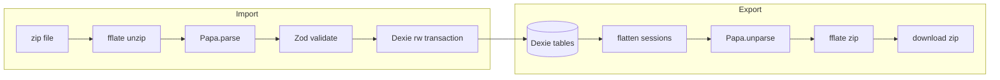

# CSV export and import plan

## Scope and library choice

- **Papa Parse** ([`papaparse`](https://www.papaparse.com/)): `Papa.unparse` for export, `Papa.parse` for import with `header: true`, `skipEmptyLines: 'greedy'`, and **`dynamicTyping: false`** so numeric fields are validated explicitly (avoids surprise booleans/nulls).
- **Bundling multiple tables**: True “single CSV” cannot represent three unrelated tables cleanly. Prefer **one downloadable archive** containing three CSVs with fixed names so round-trip is obvious:
  - Add **[`fflate`](https://github.com/101arrowz/fflate)** (~no heavy deps) to zip/unzip in the browser. If you want zero extra dependency, the alternative is three separate download links (worse UX; some browsers throttle multiple downloads).
- Install with **`vp add papaparse fflate`** per project rules (not raw `pnpm`).

## CSV schemas (document in code comments)

Stable header row per file; UTF-8; ISO dates `YYYY-MM-DD`.

| File                   | Columns                                                                                                                            | Notes                                                                                                                                                                                                                                                                                                                                   |
| ---------------------- | ---------------------------------------------------------------------------------------------------------------------------------- | --------------------------------------------------------------------------------------------------------------------------------------------------------------------------------------------------------------------------------------------------------------------------------------------------------------------------------------- |
| `categories.csv`       | `id`, `name`                                                                                                                       | Matches [`Category`](src/db/index.ts).                                                                                                                                                                                                                                                                                                  |
| `exercises.csv`        | `id`, `name`, `category`, `type`                                                                                                   | `type` ∈ `weighted`, `bodyweight`, `assisted`, `timed`. `category` must exist in `categories.csv` or DB after import order.                                                                                                                                                                                                             |
| `session_segments.csv` | `sessionId`, `sessionDate`, `sessionName`, `blockExerciseId`, `setIndex`, `segmentIndex`, `segmentExId`, `weight`, `repsOrSeconds` | One row per **segment** (element of `WorkoutSet`). Rebuild: group by `sessionId` → session meta; group rows by `(blockExerciseId, setIndex)` → ordered `WorkoutSet`; within set, sort by `segmentIndex` → `Segment[]`. `weight` empty = `null`; `repsOrSeconds` empty only where app allows (validate against exercise type on import). |

**Export** walks [`db.categories`](src/db/index.ts), [`db.exercises`](src/db/index.ts), [`db.sessions`](src/db/index.ts) and flattens each session’s `exercises[].sets` into rows (mirror of import).

**Import validation** (Zod already in project): required strings, enum for `type`, regex for date, non-negative integers for indices, numbers for `weight` / `repsOrSeconds` with rules aligned with save validation in [`log.tsx`](src/routes/log.tsx) / [`$sessionId.tsx`](src/routes/sessions/$sessionId.tsx) (e.g. timed needs positive `repsOrSeconds`; weighted/assisted need `weight` when app requires it).

Referential checks before write:

- Every `category` on exercises exists.
- Every `blockExerciseId` and `segmentExId` exists in `exercises.csv` (or will exist after same import batch).
- Session rows: consistent `sessionDate` / `sessionName` per `sessionId`.

## Write strategy (IndexedDB)

- Single **`db.transaction('rw', [db.categories, db.exercises, db.sessions], async () => { ... })`**.
- **Replace-all import** (simplest, matches “restore backup”): `clear()` each table in dependency-safe order (`sessions` → `exercises` → `categories`), then `bulkPut` categories, exercises, reconstructed sessions. Strong confirm modal copy: destructive, local-only, no undo.
- Optional later: merge-by-id (out of scope unless you want it now).

## UI and routing

- New file route **[`src/routes/settings.tsx`](src/routes/settings.tsx)** (TanStack file routing): sections **Export** (button → build zip → `URL.createObjectURL` + `<a download="gym-jam-export-YYYY-MM-DD.zip">`) and **Import** (file input `accept=".zip,application/zip"` or `.csv` if you support loose files).
- Entry point without crowding [`BottomNav.tsx`](src/components/layout/BottomNav.tsx): add a small **link or ActionIcon** in [`AppShell.tsx`](src/components/layout/AppShell.tsx) top bar (e.g. top-right “Data” / gear) or in the [`exercises/index.tsx`](src/routes/exercises/index.tsx) header—**AppShell** is better so it’s available from any tab.
- Use Mantine `Button`, native headings/Tailwind per AGENTS; toast success/error via `@mantine/notifications`.

## Code layout

- [`src/lib/csv/schemas.ts`](src/lib/csv/schemas.ts) — Zod schemas + TypeScript row types.
- [`src/lib/csv/flatten.ts`](src/lib/csv/flatten.ts) — `sessionsToRows` / `rowsToSessions` (pure functions, easy to unit test with `vite-plus/test`).
- [`src/lib/csv/export-archive.ts`](src/lib/csv/export-archive.ts) — read Dexie → CSV strings → zip bytes.
- [`src/lib/csv/import-archive.ts`](src/lib/csv/import-archive.ts) — `ArrayBuffer` → unzip → parse → validate → `bulkPut` inside transaction.
- [`src/routes/settings.tsx`](src/routes/settings.tsx) — thin UI wiring.

## Regenerate router

- After adding the route file, run **`vp dev`** or **`vp build`** once so [`src/routeTree.gen.ts`](src/routeTree.gen.ts) picks up `/settings` (or whatever path you choose, e.g. `/data`).

## Tests (recommended)

- One or two **`vite-plus/test`** cases for `rowsToSessions` / `sessionsToRows` round-trip on a tiny in-memory session (superset + drop set) to lock the flatten format.

## Risks / edge cases to handle in implementation

- **BOM** on CSV: strip `\uFEFF` from first header if present.
- **Large exports**: async zip; consider `requestIdleCallback` or chunked parse only if profiling shows need (unlikely initially).
- **Versioning**: optional `manifest.json` inside zip with `exportVersion: 1` for future format changes.

